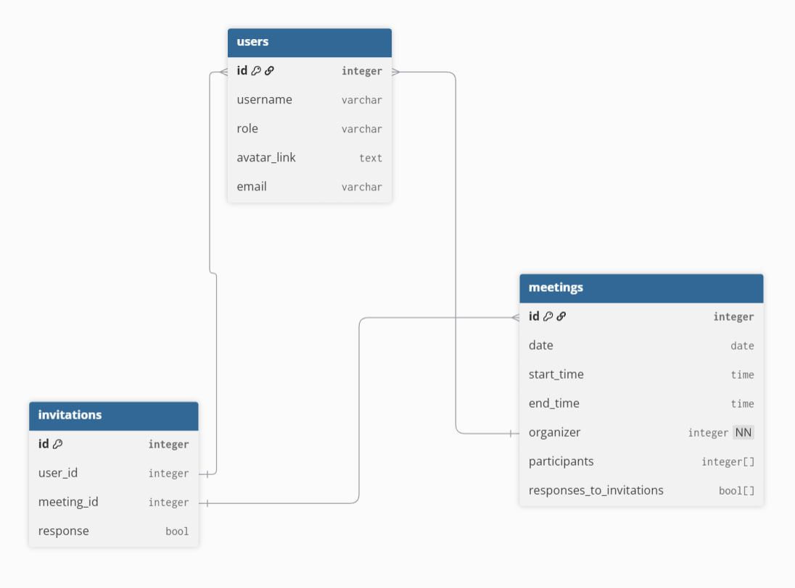

# Team 33 baga

# Техническое задание на разработку программного продукта для планирования встреч

## 1. Общие описание
Необходимо разработать программный продукт для планирования встреч сотрудников внутри компании. Система состоит из клиентского мобильного приложения и серверной части.

## 2. Клиентская часть (Android-приложение)
Клиентом является **Android-приложение**, которое должно быть реализовано на **Kotlin** или **Java** с использованием **адаптивной верстки**.

Приложение должно предоставлять интуитивно понятный интерфейс, в котором реализован следующий функционал:

*   **Регистрация и авторизация** сотрудника.
*   **Настройка личного профиля**.
*   **Создание встречи** с возможностью приглашения других сотрудников. Приглашенные сотрудники должны иметь возможность дать бинарный ответ (**принял** / **не принял**).
*   **Просмотр списка активных приглашений** на встречи с возможностью дать ответ о возможности посещения.
*   **Просмотр собственного расписания встреч** в разрезе дня, недели и месяца.

**Важное условие:** временные слоты для встреч разбиты строго по часам. Например, можно создать встречу на 9:00–10:00, но создание встречи на 9:10, 9:05 и т.д. — невозможно.

## 3. Серверная часть
Сервер представляет собой **микросервис на Spring Boot**, работающий с СУБД **PostgreSQL** или **H2**.

Серверное приложение должно:
*   Предоставлять API, необходимый для полноценной работы мобильного приложения.
*   Осуществлять все основные операции с данными в базе через **Spring Data JPA**.
*   Использовать **Liquibase** для создания схемы базы данных и ее предзаполнения.

## User Stories
1. Регистрация пользователя 
Как  сотрудник компании я хочу зарегистрироваться в приложении и войти в аккаунт, чтобы использовать приложение для планирования встреч
2. Управление профилем
Как пользователь, я хочу настроить свой профиль (имя, должность, фото), чтобы коллеги могли меня узнать.
3.  Создать встречу 
Как организатор, я хочу создать встречу с указанием времени, участников и описания, чтобы пригласить коллег.

## Use cases
Цель: Регистрация нового пользователя 
Участники: Пользователь
Предусловие: Пользователь не зарегистрирован 
Основной поток:
   1. Пользователь открывает приложение 
   2. Нажимает "Регистрация" 
   3. Вводит email, пароль, имя 
   4. Нажимает "Зарегистрироваться" 
   5. Система создает аккаунт 
   6. Пользователь переходит на главный экран 
Альтернативный поток:
   Пользователь ввел уже зарегистрированный Email и на экране выводится, что email занят.
   Или
   Пароль пользователя слишком короткий – на экране выводится ошибка о том что недостаточно символов

Цель: Редактирование профиля
Участники: Пользователь
Предусловие: Пользователь авторизован
Основной поток:
Пользователь открывает "Профиль"
Нажимает "Редактировать"
Изменяет имя, должность, загружает фото
Нажимает "Сохранить"
Система обновляет профиль

Цель: Создание встречи 
Участники: Пользователь
Предусловие: Пользователь авторизован 
Основной поток:
   1. Пользователь нажимает "Создать встречу" 
   2. Выбирает дату 
   3. Выбирает время начала (из почасовых слотов: 9:00, 10:00, и т.д.) 
   4. Выбирает время окончания 
   5. Вводит название и описание 
   6. Выбирает участников из списка сотрудников 
   7. Нажимает "Создать" 
   8. Система отправляет приглашения участникам 
   Альтернативный поток :
         Слот занят - показать предупреждение

Цель: Обработка ответов сервера
Участники: Пользователь 
Предусловие: Пользователь выполняет любое действие с отправкой данных на сервер
Основной поток (успех):
Пользователь отправляет данные на сервер (создание встречи, регистрация и т.д.)
Система успешно обрабатывает запрос
Пользователь видит уведомление об успехе: "Операция выполнена успешно"
UI обновляется с новыми данными
Альтернативный поток (ошибка формата данных):
Неверный формат email → показать "Введите корректный email"
Пароль не соответствует требованиям → показать "Пароль должен содержать минимум 6 символов"
Обязательные поля не заполнены → показать "Заполните все обязательные поля"Неверный формат даты → показать "Выберите корректную дату"

## Задачи для Backend (Spring Boot) разработчика

Описание: разработать API для регистрации и авторизации сотрудников
Требования:
  * Реализовать POST /api/auth/register
  * Реализовать POST /api/auth/login
  * Реализовать обработку ошибок

Описание: разработать API для работы с профилем 
Требования:
  * Реализовать отправку данных профиля(аватар, имя, email, должность)
  * Реализовать измениния данных профиля(аватар, имя, email, должность)
  * Реализовать обработку ошибок

Описание: разработать API для создания встреч с выбором участников
Требования:
  * Реализовать создание встреч с указанием даты, времени и участников
  * Обеспечить создание встреч только в часовых временных слотах

Описание: разработать API для обработки приглашений на встречи
Требования:
  * Реализовать отрправку приглашения
  * Реализовать получение приглашения
  * Обеспечить возможность принять или отклонить приглашение

## Схема БД

Table meetings {
  id integer [primary key]
  date date
  start_time time
  end_time time
  organizer integer [not null]
  participants integer[]
  responses_to_invitations bool[]
}

Table users {
  id integer [primary key]
  username varchar
  role varchar
  avatar_link text
  email varchar
}

Table invitations {
  id integer [primary key]
  user_id integer
  meeting_id integer
  response bool
}

Ref organizer: meetings.organizer < users.id

Ref user_invites: invitations.user_id < users.id

Ref meet_invites: invitations.meeting_id < meetings.id

